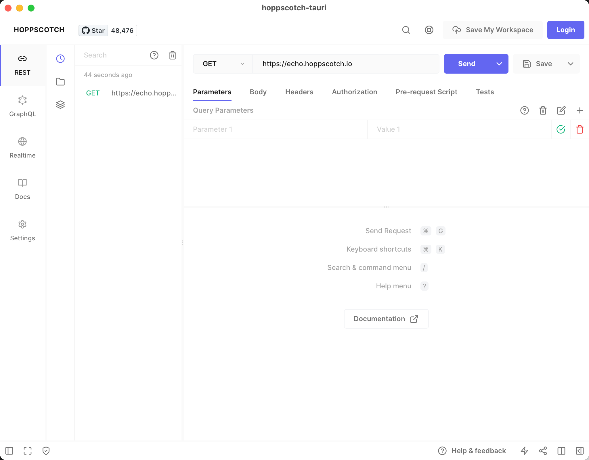

# hoppscotch-tauri



hoppscotch-tauri is a desktop requests sender that bundles [hoppscotch](https://github.com/hoppscotch/hoppscotch) and a Rust proxy server with [tauri](https://tauri.app).

## Download

[https://github.com/oyyd/hoppscotch-tauri/releases](https://github.com/oyyd/hoppscotch-tauri/releases)

## Development

See the [Prerequisites](https://tauri.app/v1/guides/getting-started/prerequisites) and start the app from source at local with:

```
cargo install tauri-cli # if you don't have
cargo tauri dev
```
